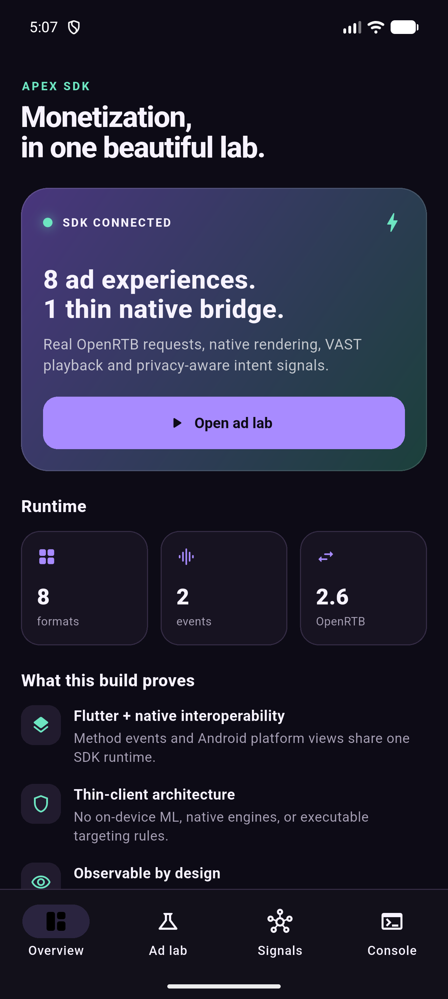
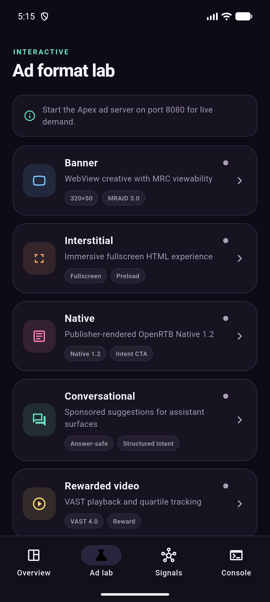
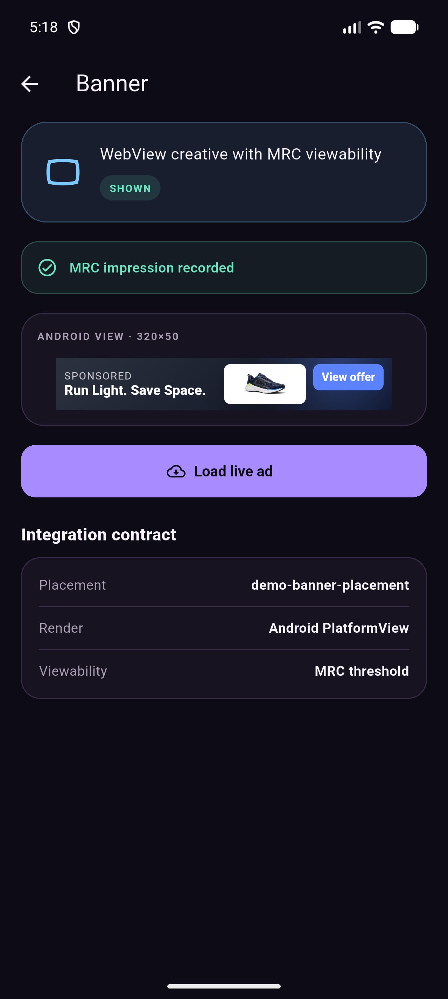
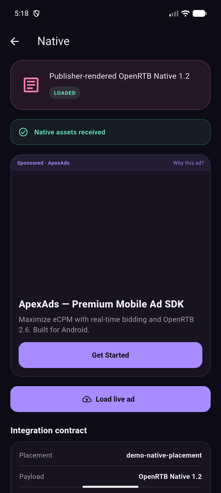
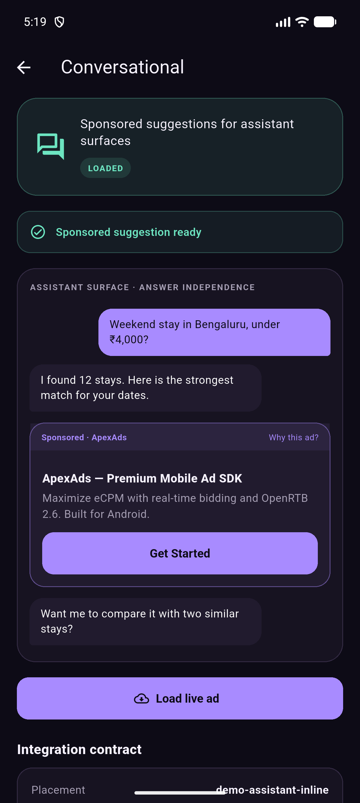

# Apex SDK Lab for Flutter

A polished, self-contained Flutter showcase for the Apex Android Ad SDK. The
app demonstrates live banner, interstitial, native, conversational, rewarded
video, app-open, in-app bidding, MRECT, and Google Wallet ad experiences.

The Apex SDK binaries are committed as Android AARs, so cloning this repository
is enough to build the app. No sibling SDK checkout is required.

## Preview

| Overview | Ad format lab |
| --- | --- |
|  |  |

### Live ad formats

| Banner | Native | Conversational |
| --- | --- | --- |
|  |  |  |

## What is included

- A responsive Material 3 Flutter interface with a live callback console.
- A thin Kotlin bridge using Flutter method channels and event channels.
- Android platform views for SDK-owned banner and viewability surfaces.
- Publisher-rendered OpenRTB Native 1.2 and conversational placements.
- VAST 4.0 rewarded playback through Android Media3.
- Debug and release Apex SDK AARs in `android/app/libs`.
- A hardened VAST parser build compatible with Android XML providers.

## Run it

Prerequisites:

- Flutter 3.35 or newer
- Android Studio and an Android SDK
- Android API 21 or newer
- A running Apex ad server for live debug demand

```bash
flutter pub get
flutter run
```

Debug SDK binaries call `http://10.0.2.2:8080`, which maps an Android emulator
to port `8080` on the development machine. Release and profile builds use the
SDK's production HTTPS endpoint.

To build installable APKs:

```bash
flutter build apk --debug
flutter build apk --release
```

## SDK integration

See the complete [Apex SDK integration guide](docs/SDK_INTEGRATION.md) for AAR
setup, Android initialization, Flutter bridging, platform views, callbacks,
placement IDs, and troubleshooting.

## Project structure

```text
lib/main.dart                         Flutter UI and bridge client
android/app/libs/                     Bundled Apex debug/release AARs
android/app/src/main/kotlin/...       Native SDK initialization and bridge
docs/SDK_INTEGRATION.md               Step-by-step integration guide
docs/screenshots/                     Verified emulator captures
```

## Verification

The project is checked with:

```bash
flutter analyze
flutter test
flutter build apk --debug
flutter build apk --release
```

Fake fill is disabled. A missing server, malformed auction response, or no-fill
is surfaced in the UI and callback console instead of being hidden by demo data.

## Android-only target

Apex is currently integrated as an Android SDK. The Flutter interface can be
ported to other platforms, but the included native bridge intentionally reports
an unsupported-platform error outside Android.
